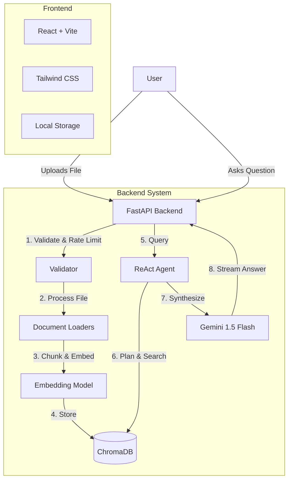

# 🤖 Agentic RAG System

An intelligent, secure, and production-ready document question-answering system powered by AI agents, vector databases, and modern web technologies.


## 🎯 Features

### **Core Capabilities**
- **Multi-Format Ingestion:** Support for PDF, DOCX, PPTX, XLSX, and TXT files.
- **Agentic Reasoning:** Uses ReAct pattern to autonomously plan, search, and answer questions.
- **Semantic Search:** Powered by ChromaDB and high-quality embeddings.
- **Source Citations:** Every answer cites specific documents and filenames.

### **Advanced Features**
- **Streaming Responses:** Real-time token streaming for a chat-like experience.
- **Relevance Filtering:** Intelligently filters out irrelevant search results (threshold: 0.3).
- **Persistent History:** Conversations survive page refreshes via local storage.
- **Reference Management:** View underlying source chunks for every answer.

### **Production-Ready Security**
- **Rate Limiting:** Protects against API abuse (5 uploads/min, 20 chats/min).
- **Validation:** Strict file size checks (10MB limit) and input sanitization.
- **Duplicate Prevention:** Automatically detects and blocks duplicate file uploads.

---

## 🏗️ Architecture



---

## 🚀 Quick Start

### 1. Prerequisites
- **Python 3.11+**
- **Node.js 18+**
- **Google Gemini API Key** (Get it [here](https://makersuite.google.com/app/apikey))

### 2. Backend Setup
```bash
# Clone repository
git clone <repo-url>
cd Agentic-RAG-System

# Create virtual environment
python -m venv venv
.\venv\Scripts\Activate.ps1   # Windows
# source venv/bin/activate    # Linux/Mac

# Install dependencies
pip install -r requirements.txt

# Configure Environment
# Create .env file with:
# GOOGLE_API_KEY=your_key_here
```

### 3. Frontend Setup
```bash
cd frontend

# Install dependencies
npm install

# Start development server
npm run dev
```

### 4. Running the System
1. **Start Backend:** `python -m uvicorn backend.main:app --reload --host 0.0.0.0 --port 8000`
2. **Start Frontend:** `npm run dev` (in separate terminal)
3. **Open Browser:** Go to `http://localhost:5173`

---

## 🧪 Testing Guide

We have implemented a comprehensive test suite covering all critical features.

### **Manual Test Checklist**
1. **Initial State:** Verify chat is disabled with yellow warning until files are uploaded.
2. **Upload:** Upload a PDF (< 10MB). Verify progress bar appears.
3. **Chat:** Ask "What is this document about?". Verify streaming response and sources.
4. **Validation:** Try uploading a file > 10MB. Verify error alert.
5. **Persistence:** Refresh page. Verify chat history remains.

See `TESTING_CHECKLIST.md` for the full 40-point inspection plan.

---

## 📂 Project Structure

```
├── backend/
│   ├── agents/          # AI Agent Logic (Planner, Retriever)
│   ├── rag/             # RAG Pipeline (Ingest, Search, Embed)
│   ├── loaders/         # Document parsers (PDF, DOCX, etc.)
│   ├── db/              # Database connections
│   └── main.py          # FastAPI Application
├── frontend/
│   ├── src/
│   │   ├── App.jsx      # Main React Component
│   │   └── index.css    # Tailwind Styles
│   └── package.json
├── chroma_db/           # Persistent Vector Store
└── requirements.txt     # Python Dependencies
```

---

## 🔧 Troubleshooting

**"Rate limit exceeded"**
- Wait 1 minute. The system limits requests to prevent abuse.

**"File too large"**
- Ensure your document is under 10MB.

**"Connection Error"**
- Ensure backend is running on port 8000.
- Check terminal for Python errors.

---

## 📚 Tech Stack
- **AI/LLM:** Google Gemini 1.5 Flash, LangChain
- **Vector DB:** ChromaDB
- **Backend:** FastAPI, Uvicorn, SlowAPI (Rate Limiting)
- **Frontend:** React, Vite, Tailwind CSS, Lucide Icons
- **Deployment:** Ready for Docker/Cloud deployment

---

*Built with ❤️ for the AI Engineer Assignment*
